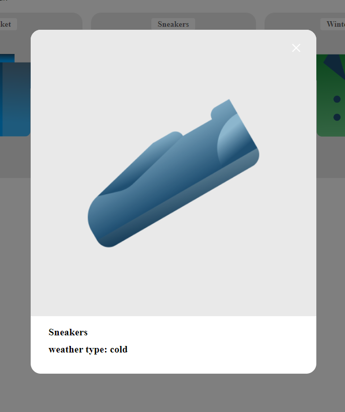
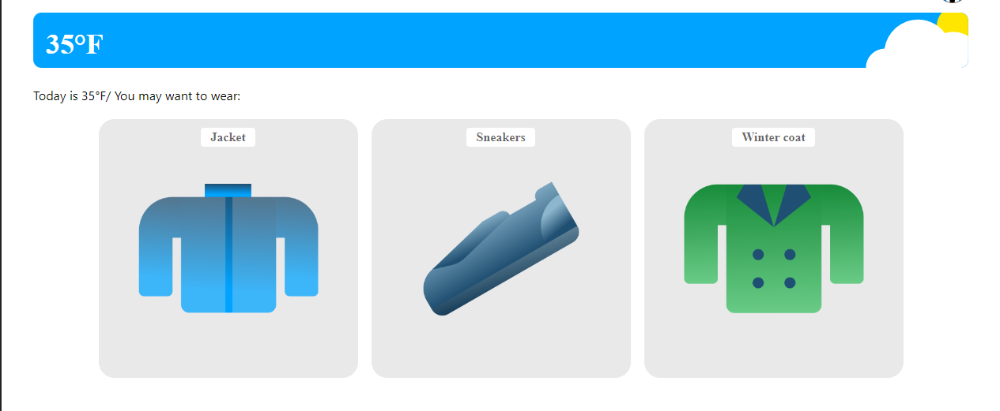
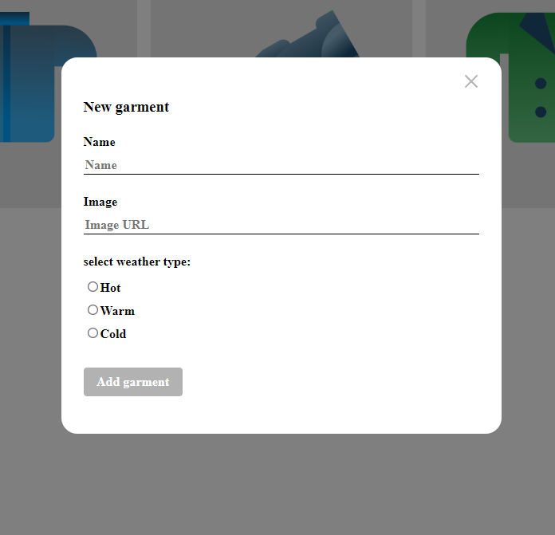

## Project name: se_project_react

<a href="https://xdro.github.io/se_project_react/">Click here to view my webiste!</a>
<a href="https://github.com/XDRO/se_project_express">Click here to check out the backend of this baby!</a>

## This project contains the following:

The index.css and index.js files.
The index.html file is stored in the public folder.
CSS files with styles for corresponding componenets.

A components directory, which contains the following components:
App.js, Footer.js, Header.js, ItemCard.js, ItemModal.js, Main.js, ModalWithForm.js, and
WeatherCard.js.

This project also contains Prop drilling, Prop drilling is the process of passing down data or state through multiple layers of a component hierarchy.

## App.js:

This is where all of the other JS files are imported to.
It contains functions such as, useEffect, UseState, and React.
Other functions include handling all other operations of the page.
This file contains clear and concise function names to help you understand the functions and the actions they preform at first glance.

## Footer:

This folder contains the creator's name(My name), as well as the copyright located in the (Footer.js) file, as well as it's corresponding css file (Footer.css).

## Screen shot:

## Header:

This folder is everything that corresponds to the Header, such as (Header.js) file, which is where the HTML that has all of the images linked to the header is stored. This file also contains Prop drilling, and is where the current date is stored. The (Header.css) file contains flex-box(display: flex) which is what is used to position everything in the header.

## Screen shot:

## ItemCard:

This is where the item cards are stored(ItemCard.js).This file is very easy to comprehend, and to understand what is exactly is happening here.(ItemCard.css) is where the cards are styled, using(display: inline-block), as well as (position: relative) in order to keep elements exactly as they are when the page is re-sized. When using media queryies this component becomes just as easy to change while keeping everything in place.

## Screen shot:

## ItemModal:

(ItemModal.js) adds more functionality to the ItemCards, as well having a responsive design when the temperature changes.

## Screen shot:

link is provided as ItemCardSS.png

## Main:

(Main.js) this is where all of the cards are filtered to select the cards that correspond to the given temperature values. This is also where the temperatures are connected through the {weatherTemp} Prop.
(Main.css) is where the padding is applied so the content never touches the edge of the screen.

## Screen shot:

## ModalWithForm:

(ModalWithForm.js) is a general layout where any forms that I may want to add in the future could use as a template.
(ModalWithForm.css) this is how the modal is positioned, styled, and overlay is added, so that users can have a better UI/UX experience.

## Screen shot:

## WeatherCard:

This folder contains the corresponding JS(WeatherCard.js) file and css(WeatherCard.css) file.
Inside of the of the (WeatherCard.js) file, is where you can find the function that filters through each image to display the corresponding image to the corresponding value you. Currently day=true and type="Sunny" so the weather image that is displayed, has those corresponding values. It also stores the {weatherTemp} on the image that is displayed.
The (WeatherCard.css) is where the image is positioned, using both (position: relative) and (position: absolute).

## Screen shot:

## utils

This folder contains the (Constants.js) file and the (WeatherApi.js) file.
(Constants.js) is where all of the const variables are stored, so that they can be exported, and then imported into any file.
(WeatherApi.js) is where I created a fetch function to retrieve all data that corresponds to the weather, as well as the location.

# Getting Started with Create React App

This project was bootstrapped with [Create React App](https://github.com/facebook/create-react-app).
This project was made with the following approach: HTML, JS and CSS files are located together inside of folders, grouped by component, making it easy to navigate.

## Available Scripts

In the project directory, you can run:

### `npm start`

Runs the app in the development mode.\
Open [http://localhost:3000](http://localhost:3000) to view it in your browser.

The page will reload when you make changes.\
You may also see any lint errors in the console.

### `npm test`

Launches the test runner in the interactive watch mode.\
See the section about [running tests](https://facebook.github.io/create-react-app/docs/running-tests) for more information.

### `npm run build`

Builds the app for production to the `build` folder.\
It correctly bundles React in production mode and optimizes the build for the best performance.

The build is minified and the filenames include the hashes.\
Your app is ready to be deployed!

See the section about [deployment](https://facebook.github.io/create-react-app/docs/deployment) for more information.

### `npm run eject`

**Note: this is a one-way operation. Once you `eject`, you can't go back!**

If you aren't satisfied with the build tool and configuration choices, you can `eject` at any time. This command will remove the single build dependency from your project.

Instead, it will copy all the configuration files and the transitive dependencies (webpack, Babel, ESLint, etc) right into your project so you have full control over them. All of the commands except `eject` will still work, but they will point to the copied scripts so you can tweak them. At this point you're on your own.

You don't have to ever use `eject`. The curated feature set is suitable for small and middle deployments, and you shouldn't feel obligated to use this feature. However we understand that this tool wouldn't be useful if you couldn't customize it when you are ready for it.

## Learn More

You can learn more in the [Create React App documentation](https://facebook.github.io/create-react-app/docs/getting-started).

To learn React, check out the [React documentation](https://reactjs.org/).

### Code Splitting

This section has moved here: [https://facebook.github.io/create-react-app/docs/code-splitting](https://facebook.github.io/create-react-app/docs/code-splitting)

### Analyzing the Bundle Size

This section has moved here: [https://facebook.github.io/create-react-app/docs/analyzing-the-bundle-size](https://facebook.github.io/create-react-app/docs/analyzing-the-bundle-size)

### Making a Progressive Web App

This section has moved here: [https://facebook.github.io/create-react-app/docs/making-a-progressive-web-app](https://facebook.github.io/create-react-app/docs/making-a-progressive-web-app)

### Advanced Configuration

This section has moved here: [https://facebook.github.io/create-react-app/docs/advanced-configuration](https://facebook.github.io/create-react-app/docs/advanced-configuration)

### Deployment

This section has moved here: [https://facebook.github.io/create-react-app/docs/deployment](https://facebook.github.io/create-react-app/docs/deployment)

### `npm run build` fails to minify

This section has moved here: [https://facebook.github.io/create-react-app/docs/troubleshooting#npm-run-build-fails-to-minify](https://facebook.github.io/create-react-app/docs/troubleshooting#npm-run-build-fails-to-minify)
